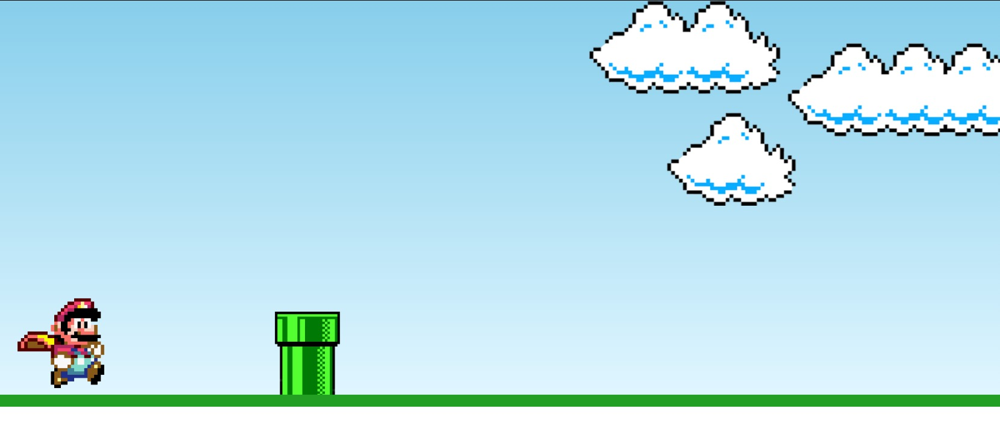

# README - Super Mário HTML5

## Um jogo simples do Mário desenvolvido com HTML5, CSS3 e JavaScript puro.

 <!-- Adicione uma imagem de preview se tiver -->

## 🚀 Como Jogar
1. **Baixe os arquivos** do jogo
2. **Abra o arquivo `index.html`** no seu navegador
3. **Pressione qualquer tecla** para fazer o Mário pular e evitar obstáculos

## 🕹️ Controles
- **Qualquer tecla do teclado**: Faz o Mário pular

## 🛠️ Tecnologias Utilizadas
- **HTML5**: Estrutura do jogo
- **CSS3**: Estilização do jogo
- **JavaScript**: Lógica do jogo e animações

## 🔧 Funcionalidades Atuais
- Personagem do Mário que reage a comandos
- Sistema básico de pulo e gravidade
- Detecção simples de colisões
- Animação básica do personagem

## 🚀 Melhorias Planejadas
- [ ] Múltiplas fases com dificuldade progressiva
- [ ] Sistema de vidas do jogador
- [ ] Tela de título animada
- [ ] Sistema de pontuação
- [ ] Coleta de moedas com efeitos
- [ ] Telas de início e game over

📝 Nota do Desenvolvedor
Este projeto foi criado seguindo o tutorial do Manual do Dev como forma de aprendizado das tecnologias web. Recomendo fortemente assistir aos vídeos do canal para entender todos os conceitos aplicados.

Aviso Legal: Todos os assets gráficos são usados apenas para fins educacionais. Os direitos de personagens como Mário pertencem à Nintendo.

---

Desenvolvido com ❤️ por Luane 
📧 Contato: dev.luane@gmail.com  
🌐 Portfolio: [seu-portfolio.com]
